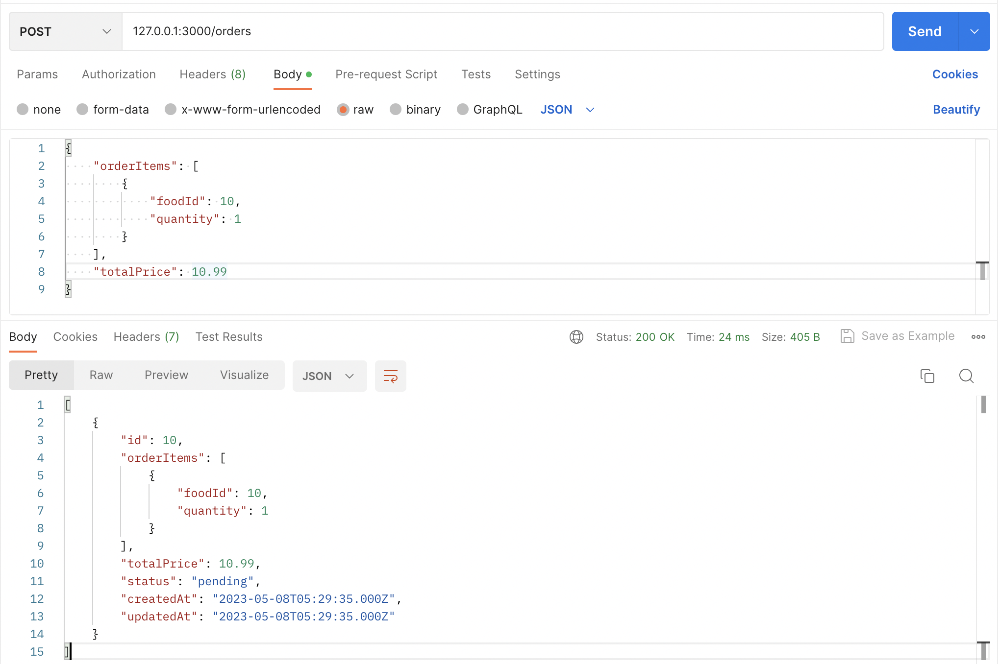
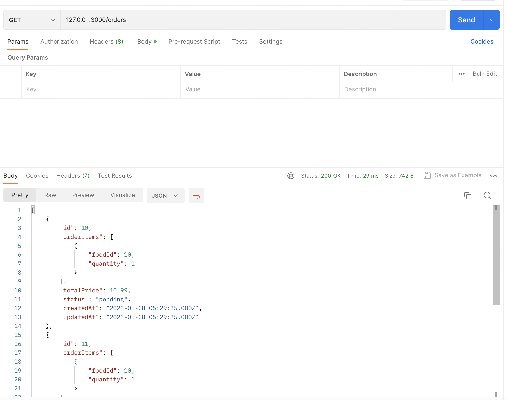
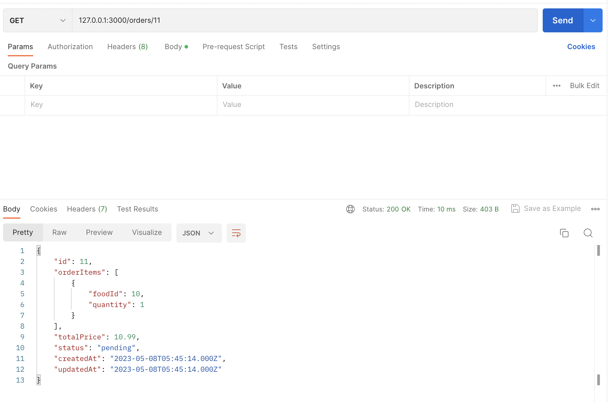
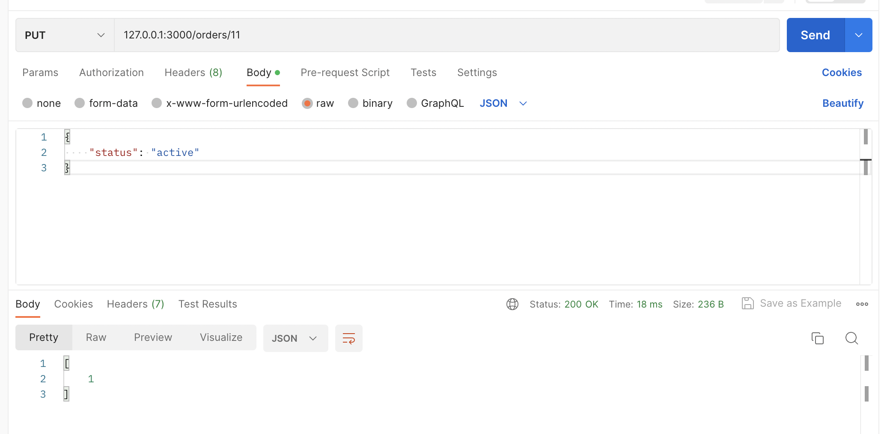
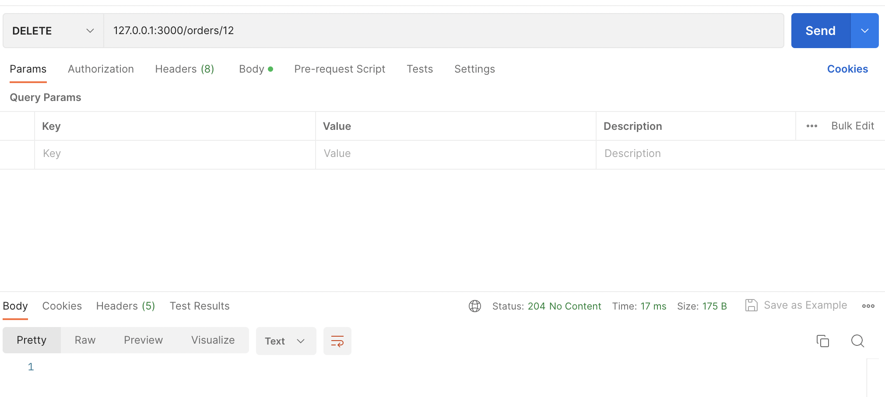

# Food Ordering System 
This is a Food Order System that allows users to place orders for food items. The system is built using Node.js and utilizes a MySQL database to store and manage data.

## Database 
The database schema consists of the following tables:

1. <b>Food</b>: This table stores information about the available food items. It includes columns such as id, itemName, itemPrice, createdAt, and updatedAt.

2. <b>Orders</b>: This table represents orders placed by users. It contains columns like id, totalPrice, status, createdAt, and updatedAt.

3. <b>OrderFood</b>: This table serves as an association table to establish a many-to-many relationship between Orders and Food tables. It includes columns like orderId, foodId, createdAt, and updatedAt.

## APIs
The system exposes the following RESTful APIs:

1. POST /orders Create a new order by providing order details such as orderItems (an array of food items with quantity) and totalPrice. Returns the created order.

2. GET /orders/id Retrieve information about a specific order by its ID.

3. GET /orders Retrieve a list of all orders placed.

4. PUT /orders/id Update the status of a specific order.

5. DELETE /orders/id Delete a specific order.

You can use these APIs to interact with the Food Order System and perform operations such as placing orders, and retrieving order details.

## Getting Started
To get started with the Food Order System, follow these steps:

1. Clone the repository and navigate to the project directory.
2. Install the required dependencies using npm install.
3. Configure the MySQL database connection by updating the database credentials in the configuration files.
4. Run the database migrations to create the necessary tables using npm run migrate.
5. Start the server using npm start.
6. Access the APIs using a REST API client (e.g., Postman) by making requests to http://localhost:3000.
7. Make sure you have Node.js and a MySQL database installed and properly configured before running the system.

## Examples for the APIs
<b> POST /orders </b>

<b> GET /orders </b>

<b> GET /orders/id </b>

<b> PUT /orders/id </b>

<b> DELETE /orders/id </b>

